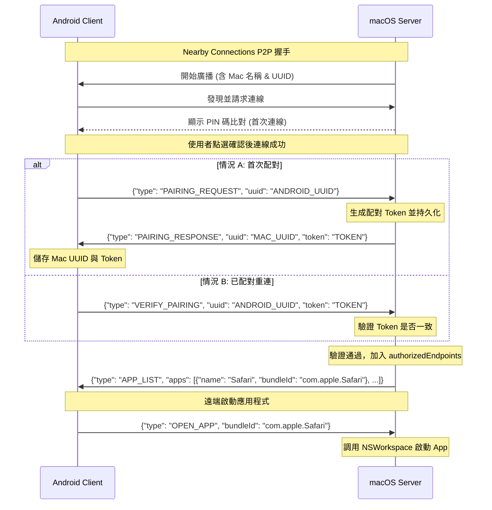

# AirDock 💻📱

[](macOS_App/)
[](Android_App/)
[](LICENSE)

**AirDock** 是一個跨平台的智慧桌面協同工具，讓您能夠透過 Android 手機遠端瀏覽、管理與啟動 macOS 上的應用程式。本專案利用 Google 的 **Nearby Connections API** 實現完全離線、低延遲的點對點（P2P）連線，結合了 macOS 與 Android 的原生優勢，並在 Android 端提供極具質感的毛玻璃（Glassmorphism）Dock 介面。

---

## 🌟 核心功能

*   **⚡ 點對點離線連線**：使用 Wi-Fi 與藍牙（Google Nearby Connections）建立本機連接，無需透過任何雲端伺服器，資料不外流，隱私度高且速度極快。
*   **🔒 安全配對機制 (PIN Verification)**：首次連線時透過 PIN 驗證碼進行安全比對，避免被未授權的裝置連線。
*   **🔄 自動重新連線 (Paired Autoconnect)**：一次配對成功後，系統將安全儲存配對 Token，下次雙端開啟時會自動進行安全握手並連線。
*   **🔍 自動應用程式掃描**：macOS 端會自動掃描 `/Applications` 與 `/System/Applications` 下安裝的 App（過濾系統安裝器或解除安裝器），自動生成應用程式清單。
*   **🖥️ 毛玻璃極簡 Dock 介面**：Android 端擁有精美的毛玻璃風格 Dock，支援橫向滾動與動畫效果，還原 macOS 原生 Dock 的視覺衝擊。
*   **📌 快捷 Dock 客製化**：使用者可以在 Android 端長按或點選管理按鈕，自由挑選需要釘選在 Dock 的 macOS 應用程式。
*   **🚀 遠端一鍵啟動**：點擊 Android Dock 上的圖示，Mac 端會立刻以原生 `NSWorkspace` 的 API 快速將應用程式喚醒並呈現在最上層。

---

## 🛠️ 技術棧與專案架構

本專案分為 **Android 控制端** 與 **macOS 伺服器端** 兩部分：

```
Mac_dock/
├── macOS_App/              # macOS 伺服器端 (SwiftUI / Cocoa)
│   ├── macOS_App/          # 原始碼 (NearbyService, ContentView 等)
│   ├── Mac_Dock_Control.xcodeproj  # Xcode 專案 (將會被重編譯為 AirDock)
│   └── project.yml         # XcodeGen 配置檔
└── Android_App/            # Android 控制端 (Kotlin / Jetpack Compose)
    ├── app/                # 原始碼 (Compose UI, NearbyService 整合)
    └── build.gradle.kts    # Gradle 建置檔
```

### 1. macOS 伺服器端 ([macOS_App](file:///Users/andy/AI_Project/Mac_dock/macOS_App))
*   **開發語言**：Swift 5.x
*   **介面框架**：SwiftUI
*   **系統 API**：AppKit (`NSWorkspace` 應用程式調度)
*   **核心套件**：[Google NearbyConnections Apple SDK](https://github.com/google/nearby)
*   **功能**：啟動 Nearby Connection 廣播（Advertising），自動列出並過濾本機 App，接收 Android 端指令並執行 `NSWorkspace.shared.openApplication`。

### 2. Android 控制端 ([Android_App](file:///Users/andy/AI_Project/Mac_dock/Android_App))
*   **開發語言**：Kotlin (Coroutines / Flow)
*   **介面框架**：Jetpack Compose (Material 3, 響應式動畫)
*   **核心套件**：Google Play Services Nearby Connections API
*   **功能**：Nearby Connection 掃描尋找（Discovery），獲取 macOS App 清單，將已選 App 釘選至 Dock，一鍵傳送啟動 Payload。

---

## 📡 通訊協定與 Payload 格式

裝置間以 UTF-8 JSON Payload 進行 P2P 訊息交換：

### 連線建立與配對流程



---

## 🚀 快速開始

### macOS 端設定

#### 方式 A：直接使用預編譯 DMG
1. 進入 `macOS_App` 目錄。
2. 雙擊打開 [AirDock.dmg](file:///Users/andy/AI_Project/Mac_dock/macOS_App/AirDock.dmg)。
3. 將 **AirDock** 拖曳至您的 `/Applications` 資料夾。
4. 啟動 App，點擊 **"Start Advertising"**。
5. *注意：由於是點對點通訊，系統可能會提示需要授予藍牙與本地網絡權限。*

#### 方式 B：自行編譯 Xcode 專案
1. 您需要安裝 Xcode 13+。
2. 如果修改了 `project.yml`，可使用 `xcodegen` 重新生成專案檔案：
   ```bash
   cd macOS_App
   xcodegen generate
   ```
3. 打開新生成的 `Mac_Dock_Control.xcodeproj`（或目標為 **AirDock** 的專案）。
4. 選擇您的 Mac 作為目標，按下 **Cmd + R** 執行。

---

### Android 端設定

1. 使用 Android Studio (Ladybug 或更新版本) 打開 `Android_App`。
2. 連接您的實體 Android 裝置（需開啟開發者模式與 USB 偵錯，並確保 Wi-Fi 與藍牙開啟）。
3. 點擊 **Run 'app'** 進行編譯與安裝。
4. 首次開啟時，請允許 **位置資訊、藍牙掃描/連線** 相關權限（ Nearby Connections API 所需）。
5. 點擊 **Connect** 開始掃描您 Mac 所廣播的服務。
6. 當雙端彈出配對 PIN 碼時，確認無誤後皆點選「**Confirm**」。
7. 連線成功後，Android 端會拉取 Mac 的應用程式清單。點選右上角的 **Manage** 按鈕或長按 Dock，勾選您要釘選到 Dock 的應用程式，隨即可從手機上一鍵遙控 Mac 開啟應用程式！

---

## ⚠️ 常見問題與排除 (Troubleshooting)

1. **連線失敗或找不到裝置？**
   * Nearby Connections API 在 macOS 與 Android 間傳輸需要**同時開啟 Wi-Fi 與藍牙**。請確保兩台裝置的 Wi-Fi 與藍牙皆處於開啟狀態（無需連接同一個 Wi-Fi 熱點，但建議在同一個區域網內以獲得更穩定的 Wi-Fi Direct 連線）。
   * 請確認 macOS 的系統偏好設定中，已允許本 App 的「局域網（Local Network）」與「藍牙（Bluetooth）」存取權限。
2. **Mac App 無法啟動？**
   * 部分系統沙盒（Sandbox）限制可能會阻止應用程式調用。本專案已在 `project.yml` 中預設關閉 `ENABLE_APP_SANDBOX: "NO"`。若自行編譯，請確認 Target 的 Signing & Capabilities 中沒有開啟沙盒，或將其設定為允許啟動其他 App 的權限。
3. **想重新配對裝置？**
   * Android 端：在主頁面上點選右上角的「Unpair Devices」選項以清除已儲存的 Mac 配對憑證。
   * macOS 端：重新啟動伺服器或清除 `UserDefaults` 即可重設配對狀態。

---

## 📄 開源授權

本專案基於 **MIT License** 授權條款開源。詳見 [LICENSE](LICENSE) 檔案。
